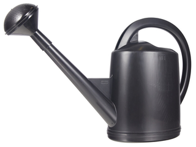
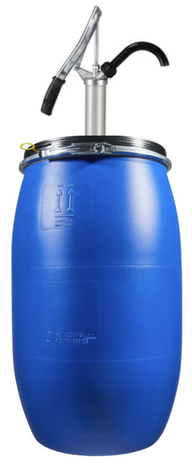

# Mitwelten IoT Toolkit: Lamenting Tree

Work in progress, see [project tasks](https://github.com/orgs/mitwelten/projects/29/views/1). Questions? Contact thomas.amberg@fhnw.ch

## Algorithm
Based on [FHNW IoT Bricks](https://github.com/tamberg/fhnw-iot-bricks) inspired by [Botanicalls](https://www.botanicalls.com).

```Java
... // presence, movement, moisture, fader, sound and graph brick
while (true) {
    boolean presence = presenceBrick.isActive(); // triggered by neighbor
    boolean watering = movementBrick.isActive(); // triggered by neighbor
    int moisture = moistureBrick.getMoisture(); // changes when watering
    int threshold = faderBrick.getPosition() * 10; // set by researcher
    if (presence && !watering && moisture < threshold) {
        soundBrick.play(SAMPLE_LAMENT, VOLUME_LOUD);
    } else if (presence && watering && moisture > threshold) {
        soundBrick.play(SAMPLE_THANK, VOLUME_NORMAL);
    }
    graphBrick.addValue(moisture); // monitored by researcher
    proxy.waitForUpdate();
}
```

<!--
## Distance Sensor


### Software
- [ESP8266_MqttDistanceBrick.ino](https://github.com/tamberg/fhnw-iot-bricks/blob/develop/Arduino/ESP8266_MqttDistanceBrick/ESP8266_MqttDistanceBrick.ino)
- [DistanceBrick.java](https://github.com/tamberg/fhnw-iot-bricks/blob/develop/Java/src/main/java/ch/fhnw/imvs/bricks/sensors/DistanceBrick.java)

### Hardware
- [Feather HUZZAH ESP8266 w/ Stacking Headers](https://www.adafruit.com/product/3046)
- [FeatherWing Grove Adapter](https://www.adafruit.com/product/5862)
- [Grove Ultrasonic Ranger](https://www.seeedstudio.com/Grove-Ultrasonic-Distance-Sensor.html)
- [3000 mAh 18650 Li-Ion Battery w/ Holder](https://www.bastelgarage.ch/solar-lipo/li-ion-akku-3000ma-18650-mit-schutzelektronik-und-stecker)

### Enclosure
- [AP9 Junction Box](https://new.abb.com/products/2TKA140012G1/ap9-junction-box-ip65)
-->

## Presence Sensor
&nbsp;

### Software
- [ESP8266_MqttDigitalInputBrick.ino](https://github.com/tamberg/fhnw-iot-bricks/blob/develop/Arduino/ESP8266_MqttDigitalInputBrick/ESP8266_MqttDigitalInputBrick.ino)
- [PresenceBrick.java](https://github.com/tamberg/fhnw-iot-bricks/blob/develop/Java/src/main/java/ch/fhnw/imvs/bricks/sensors/PresenceBrick.java)

### Hardware
- [Feather HUZZAH ESP8266 w/ Stacking Headers](https://www.adafruit.com/product/3046)
- [FeatherWing Grove Adapter](https://www.adafruit.com/product/5862)
- [Grove Adjustable PIR Motion Sensor](https://www.seeedstudio.com/Grove-Adjustable-PIR-Motion-Sensor.html)
- [3000 mAh 18650 Li-Ion Battery w/ Holder](https://www.bastelgarage.ch/solar-lipo/li-ion-akku-3000ma-18650-mit-schutzelektronik-und-stecker)

### Enclosure
- [AP9 Junction Box](https://new.abb.com/products/2TKA140012G1/ap9-junction-box-ip65)

## Movement Sensor


### Software
- nRF52840Sense_MovementBrick.ino (TODO)
- MovementBrick.java (TODO)

### Hardware
- [Feather nRF52840 Sense](https://www.adafruit.com/product/4516)
- [Feather Female Headers](https://www.adafruit.com/product/2886)
- [FeatherWing AirLift ESP32](https://www.adafruit.com/product/4264)
- [3000 mAh 18650 Li-Ion Battery w/ Holder](https://www.bastelgarage.ch/solar-lipo/li-ion-akku-3000ma-18650-mit-schutzelektronik-und-stecker)

### Enclosure
- [AP9 Junction Box](https://new.abb.com/products/2TKA140012G1/ap9-junction-box-ip65)

## Moisture Sensor
&nbsp;

### Software
- [ESP32_MqttAnalogInputBrick.ino](https://github.com/tamberg/fhnw-iot-bricks/blob/develop/Arduino/ESP32_MqttAnalogInputBrick/ESP32_MqttAnalogInputBrick.ino)
- [MoistureBrick.java](https://github.com/tamberg/fhnw-iot-bricks/blob/develop/Java/src/main/java/ch/fhnw/imvs/bricks/sensors/MoistureBrick.java)

### Hardware
- [Feather ESP32 HUZZAH w/ Stacking Headers](https://www.adafruit.com/product/3619)
- [FeatherWing Grove Adapter](https://www.adafruit.com/product/5862)
- [Grove Soil Moisture Sensor](https://www.seeedstudio.com/Grove-Capacitive-Moisture-Sensor-Corrosion-Resistant.html)
- [3000 mAh 18650 Li-Ion Battery w/ Holder](https://www.bastelgarage.ch/solar-lipo/li-ion-akku-3000ma-18650-mit-schutzelektronik-und-stecker)

### Enclosure
- [AP9 Junction Box](https://new.abb.com/products/2TKA140012G1/ap9-junction-box-ip65)

## Threshold Fader


### Software
- [ESP32_MqttAnalogInputBrick.ino](https://github.com/tamberg/fhnw-iot-bricks/blob/develop/Arduino/ESP32_MqttAnalogInputBrick/ESP32_MqttAnalogInputBrick.ino)
- [FaderBrick.java](https://github.com/tamberg/fhnw-iot-bricks/blob/develop/Java/src/main/java/ch/fhnw/imvs/bricks/sensors/FaderBrick.java)

### Hardware
- [Feather ESP32 HUZZAH w/ Stacking Headers](https://www.adafruit.com/product/3619)
- [FeatherWing Grove Adapter](https://www.adafruit.com/product/5862)
- [M5Stack Grove Fader](https://www.bastelgarage.ch/m5stack-fader-unit-with-potentiometer-and-rgb-lighting?search=m5stack%20fader)
- [3000 mAh 18650 Li-Ion Battery w/ Holder](https://www.bastelgarage.ch/solar-lipo/li-ion-akku-3000ma-18650-mit-schutzelektronik-und-stecker)

### Enclosure
- [AP9 Junction Box](https://new.abb.com/products/2TKA140012G1/ap9-junction-box-ip65)
- [FaderAdapter.stl](OpenScad/Fader/FaderAdapter.stl)

## Graph Monitor


### Software
- ESP32S3_GraphDisplayBrick_ST7789.ino (TODO)
- GraphDisplayBrick.java (TODO)

### Hardware
- [QT Py ESP32-S3](https://www.adafruit.com/product/5395)
- [QT Py EYESPI BFF](https://www.adafruit.com/product/5772)
- [EYESPI Cable 100 mm](https://www.adafruit.com/product/5239)
- [240x240 px TFT LCD](https://www.adafruit.com/product/4313)
- [3000 mAh 18650 Li-Ion Battery w/ Holder](https://www.bastelgarage.ch/solar-lipo/li-ion-akku-3000ma-18650-mit-schutzelektronik-und-stecker)

### Enclosure
- [AP9 Junction Box](https://new.abb.com/products/2TKA140012G1/ap9-junction-box-ip65)

## Sound Player
&nbsp;

### Software
- [ESP32_SoundBrick.ino](https://github.com/tamberg/fhnw-iot-bricks/blob/develop/Arduino/ESP32_MqttSoundBrick_VS1053/ESP32_MqttSoundBrick_VS1053.ino)
- [SoundBrick.java](https://github.com/tamberg/fhnw-iot-bricks/blob/develop/Java/src/main/java/ch/fhnw/imvs/bricks/actuators/SoundBrick.java)

### Hardware
- [Feather ESP32 HUZZAH w/ Stacking Headers](https://www.adafruit.com/product/3619) (TBC)
- [FeatherWing MP3 Player](https://www.adafruit.com/product/3357)
- [3000 mAh 18650 Li-Ion Battery w/ Holder](https://www.bastelgarage.ch/solar-lipo/li-ion-akku-3000ma-18650-mit-schutzelektronik-und-stecker)

### Enclosure
- [AP9 Junction Box](https://new.abb.com/products/2TKA140012G1/ap9-junction-box-ip65)

## Bluetooth Speaker
&nbsp;

### Hardware
- [Hama Bluetooth Speaker](https://www.digitec.ch/en/s1/product/hama-pocket-30-14-h-rechargeable-battery-operated-bluetooth-speakers-23952994)
- [Ugreen 3.5 mm Jack Cable](https://www.digitec.ch/en/s1/product/ugreen-35mm-klinke-35mm-klinke-1-m-35mm-jack-aux-audio-cable-20685666)

### Enclosure
- [AP10 Junction Box](https://new.abb.com/products/2TKA140002G1/ap10-junction-box-ip65)
- [Hama_AP10Adapter](https://github.com/mitwelten/mitwelten-iot-hardware-poc/tree/main/OpenScad/Hama_AP10Adapter)

## Watering Cans


### Material
- [Watering Can, 10L](https://www.jumbo.ch/de/gartenbau-technik/bewaesserung/giesskannen/oecoplan-giesskanne--10-l/p/6042776?trackingtoken=search%7Carea1%7CA%7CStandardkampagne%7Csearch_searchterm_related%7CST2P)
- [Watering Can, 4L](https://www.jumbo.ch/de/gartenbau-technik/bewaesserung/giesskannen/oecoplan-giesskanne-kunststoff--4-l/p/6042772)

## Fountain


### Material
- [Barrel, 120L](https://www.jumbo.ch/de/gartenbau-technik/werkzeug-geraete/abfall-behaelter/kunststoffbehaelter/faserplast-universalfass-blau--78--49-cm--120-l/p/3251409)
- [Hand Pump](https://www.hornbach.de/p/stahlrohr-fasspumpe-pressol-srl-13012-16l-min/6388902/?sourceArt=6388903&trackArticleCrossType=se&url=6388902)

## Lab test


- [Video "Hello, I need water!"](https://flickr.com/photos/tamberg/53830837560)
- [Video "Lamenting threshold"](https://flickr.com/photos/tamberg/53830401296)

## Field test
TODO
